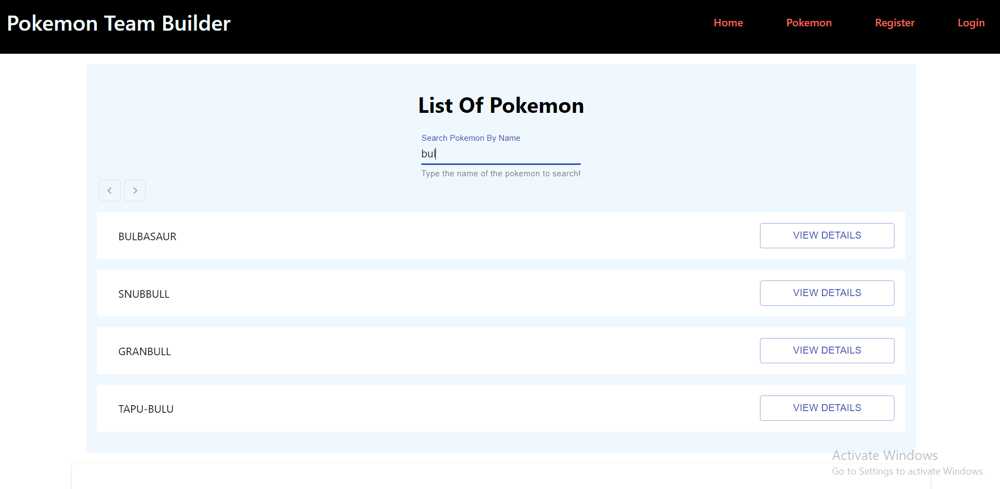
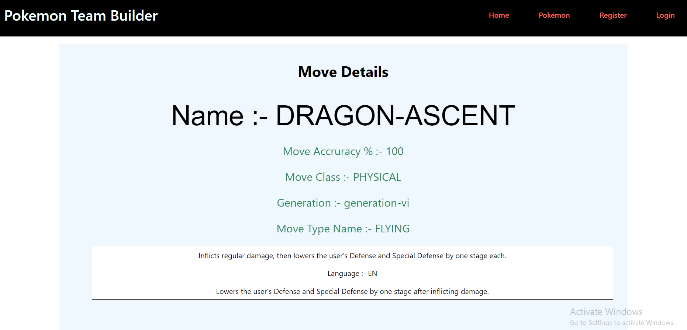
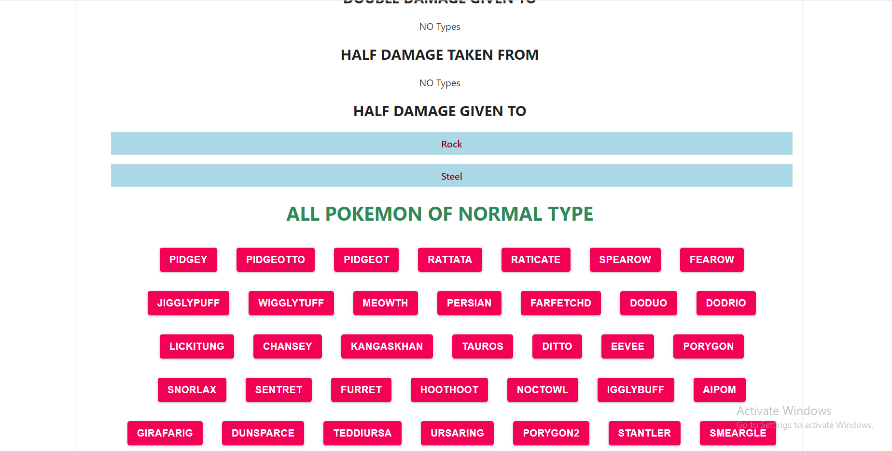
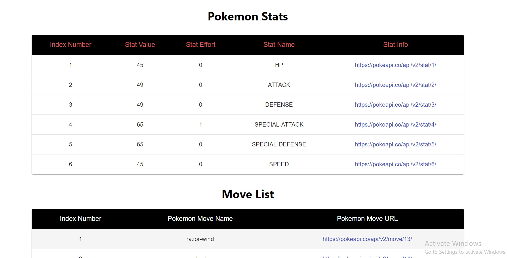
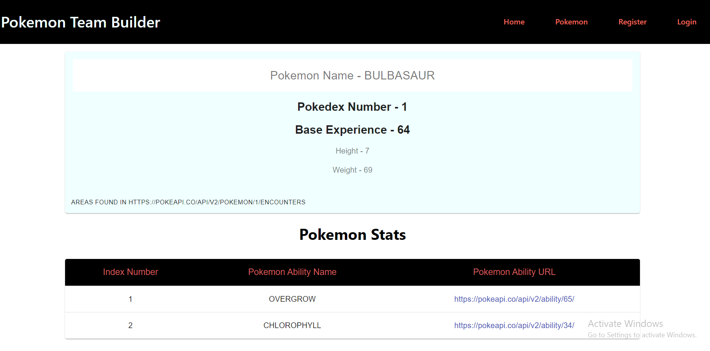
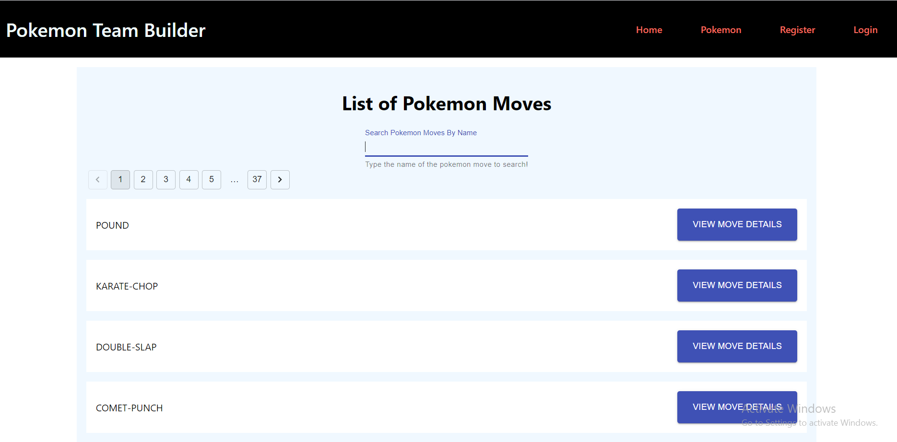

# A Pokemon Battle Arena Database Application in React using Material UI design.

A Pokemon database application using the open source API provided by pokeapi.com. I'd highly recommend using this open 
API, these people are doing really awesome job. The application would display
information related to pokemon like pokemon names, pokemon moves,
pokemon items and more in a component and pages based modular design in React JS. It is built
on top of Material UI kit.

## Getting Started

* If you have worked with React and npm projects before, you'd know the procedure is fairly simply. Take the clone of the project, run 'npm install' and then
type in 'npm start'. It's the only script in this project thus far.

* For people not coming from node background, you need to install Node.js
runtime environment on your system and then install packages and using it to run the project following the steps described above. 

## Built With

* [React JS](https://reactjs.org/)
* [Material UI](https://material-ui.com/)
* [React Redux](https://redux.js.org/)
* [HTML + CSS + SCSS](https://www.w3schools.com/html/html_css.asp) - Used to generate RSS Feeds

## Authors

* **Amit Prafulla (APFirebolt)** - (http://amitprafull.com/)

## License

This project is licensed under the MIT License - see the [LICENSE.md](LICENSE.md) file for details

## Screenshots

Please find some of the screenshots of the application. Below is the screenshot depicting search pokemon page with
applied filters.

Pokemon Move details page. Here move details for Rayquaza's signature move 'Dragon accent' is displayed. I agree not an aesthetic
UI design, but that works for me for now at least.

Pokemon types detail page showing all moves and pokemon belonging to that category.

Pokemon statistics pages showing stats for an individual.

Another Image of the same page XD.

List of all pokemon moves.

This project was bootstrapped with [Create React App](https://github.com/facebook/create-react-app).

